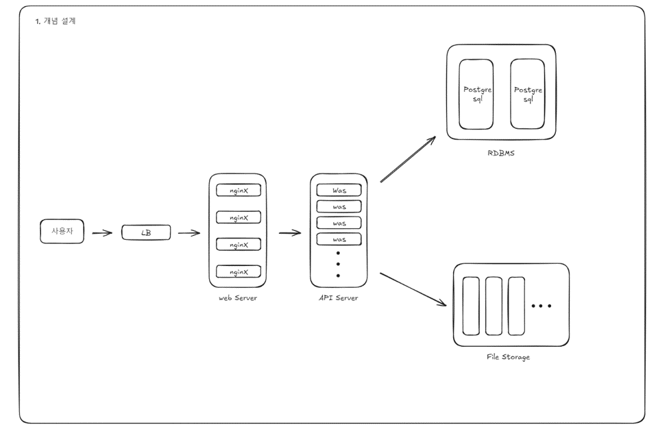
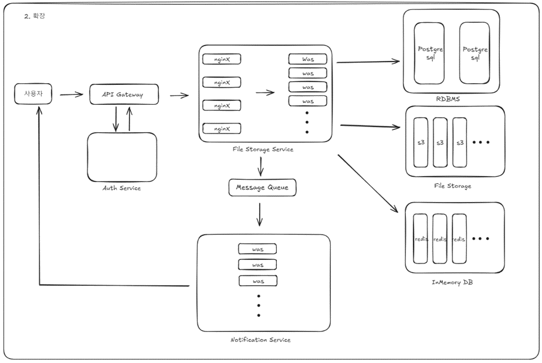

# 기본설계

- RDBMS에는 서비스 사용자의 메타데이터를 기록한다. 사용자정보, 사용자 작업영역, 파일에 대한 정보 , 히스토리 등
- 사용자가 저장하는 파일은 File Storage에 저장한다.

### API GateWay + Auth Service

- 사용자 요청시, 서비스를 이용가능한 사용자인지 식별한다.

### Notification Service

- 알림을 전달한다. (그룹 파일 CRUD, 그룹참여 등)

## File Storage Service

**Service**

- 클라이언트와 상호작용 (Long Polling) 하여 진행중 작업의 진행상황을 알린다.

**RDBMS**

- 서비스 메타데이터를 기록
- 사용자의 작업영역(workspace)에 대한 정보, 파일, 유저 등의 대한 정보 (`강한일관성`)

**File Storage**

- 실제 사용자의 파일들이 저장
- AWS S3을 사용예정

**InMemory DB**

- 사용자의 작업현황 정보를 InMemory DB에 기록한다.
- (S3) block 단위 파일 업로드 마다 Cache를 조회/ 갱신한다.

### 추가 고려해야하는 사항 (확인을 더 해야하는 부분)

- InMemoryDB (NoSQL) 키 정책
- 네트워크 대역폭
- API GateWay + Auth Service 인증 정책
